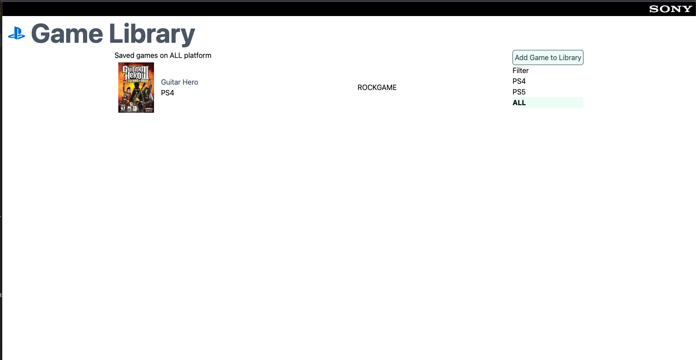

# AWS Serverless Web App



The easy way to review would be following [Development Section](#development)
and read the [Code Review Section](#code-review)

## Code Review

[Endpoint exposed](systems/api/schema.graphql)

[Frontend code related to feature](systems/web/src/GameLibraryPage)

[API code related to feature](systems/api/src/game-gallery)

[Infrastructure setup](systems/infrastructure/src/index.ts)

## Development

Below script will set up the project and start the dev server.
You can try change app code and see the result in real time.

```sh
bash ./scripts/setup.sh
bash ./scripts/dev.sh

Open http://localhost:3000 for dev
```

## Deployment

Before you can do the deployment, you need to configure AWS CLI.
[Follow here to configure AWS CLI](https://docs.aws.amazon.com/cli/latest/userguide/getting-started-quickstart.html)

To complete follow below steps, you also need
[Github CLI](https://cli.github.com/manual/)
installed.

it optional because you always can merge back the release branch
manually by create PR in GitHub.

Current it has only one deployment environment `production`.
You can deploy it by running below script.

```sh
bash
# After that script it create the release branch
# and setup all requested resource in AWS 
# then deploy application to the resource.
source ./scripts/deploy.sh production
# You should merge back the release branch to base branch.
gh pr create --title "Merge back v$RELEASE_VERSION" \
--body "Bump version to v$RELEASE_VERSION" \
--base $CURRENT_BRANCH --head "$RELEASE_BRANCH" 
```
